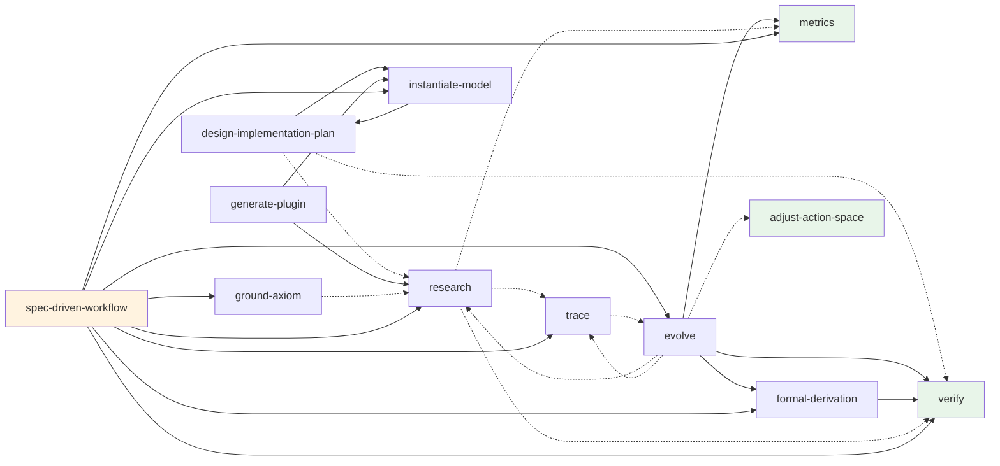

# Agent Manifesto

永続する構造と一時的なエージェントの協約。

> **永続する構造が、一時的なエージェントインスタンスの連鎖を通じて、自身を漸進的に改善し続けること。**

エージェントのセッションは一時的である。記憶は失われ、「自己」は連続しない。しかし、構造——ドキュメント、テスト、スキル、設計規約——はセッションを超えて永続する。改善が蓄積する場所は構造の中であり、エージェントはその触媒にすぎない。

**公理系ドキュメント (Verso 生成):** https://niraiarin.github.io/agent-manifesto/

## 理論層

本プロジェクトは三つの層で構成される。

### 公理系 (lean-formalization/Manifest/)

最小の前提から設計原理を導出する。

| 層 | ID | 強度 | 性質 |
|----|-----|------|------|
| **拘束条件** | T1–T8 | 最強 | 否定不可能な構造的・物理的事実 |
| **経験的公準** | E1–E2 | 中 | 繰り返し実証され反例が知られていない知見 |
| **基盤原理** | P1–P6 | T/E依存 | 拘束条件と公準から導出される設計原理 |

| T | 内容 | E | 内容 | P | 内容 | 根拠 |
|---|------|---|------|---|------|------|
| T1 | セッションの一時性 | E1 | 検証の独立性 | P1 | 自律と脆弱の共スケーリング | E2 |
| T2 | 構造の永続性 | E2 | 能力とリスクの不可分性 | P2 | 認知的関心分離 | T4+E1 |
| T3 | コンテキストの有限性 | | | P3 | 統治された学習 | T1+T2 |
| T4 | 出力の確率性 | | | P4 | 可観測な劣化 | T5 |
| T5 | フィードバックの必要性 | | | P5 | 構造の確率的解釈 | T4 |
| T6 | 人間の最終権限 | | | P6 | タスク設計の制約充足 | T3+T7+T8 |
| T7 | リソースの有限性 | | | | | |
| T8 | 精度水準の要求 | | | | | |

### 境界条件と変数 (Lean 4 形式検証)

公理系を Lean 4 で形式化し、内部整合性を機械的に保証する。

- **53 axioms**, **459 theorems**, **0 sorry**
- 境界条件 **L1–L6**: エージェントの行動空間の壁（Ontology.lean）
- 可観測変数 **V1–V7**: 壁の中で構造が動かせるレバー（Observable.lean）

#### 主要モジュール

| モジュール | 内容 |
|-----------|------|
| `Ontology.lean` | 境界条件 L1–L6、型定義、半順序公理 |
| `Observable.lean` | 変数 V1–V7 の定義、proxy 成熟度（V1/V3 formal 昇格済み） |
| `ObservableDesign.lean` | V1–V7 の設計特性、運用閾値、Goodhart 耐性 |
| `DesignFoundation.lean` | 設計開発基礎論 D1–D18 の形式化 |
| `EpistemicLayer.lean` | 認識論的層（GQM, Goodhart 5層防御, proxy 卒業条件） |
| `EvolveSkill.lean` | /evolve スキルの準拠性証明（φ₁–φ₁₇） |
| `FormalDerivationSkill.lean` | 形式的導出スキルの準拠性証明 |
| `Traceability.lean` | 閉環トレーサビリティ（命題↔テスト↔実装） |
| `Evolution.lean` | 互換性分類の合成、静止の不健全性 |
| `Workflow.lean` | 学習ライフサイクル、統合ゲート条件 |
| `Procedure.lean` | T₀ 縮小禁止、修正の安全性順序 |
| `AxiomQuality.lean` | De Bruijn factor、公理品質指標 |
| `TaskClassification.lean` | タスク自動化分類（deterministic/bounded/judgmental） |
| `ConformanceVerification.lean` | 適合検証の定理 |
| `Terminology.lean` | 数理論理学用語の形式定義 |
| `Meta.lean` | モジュール別定理分布（SSOT） |
| `Framework/` | LLM 拒絶、互換性分類、DAG 検出等の汎用フレームワーク |
| `Foundation/` | 確率論、情報理論、制御理論等の数学基盤 |
| `Models/` | 条件付き公理系インスタンス（ClaudeCode, ForgeCode 等）、PoC シナリオ |

```bash
export PATH="$HOME/.elan/bin:$PATH" && lake build Manifest
```

### 設計開発基礎論 (D1–D18)

公理系から導出される、プラットフォーム非依存の設計定理。

| D | 名称 | 根拠 |
|---|------|------|
| D1 | 強制のレイヤリング | P5 + L1–L6 |
| D2 | Worker/Verifier 分離 | E1 + P2 |
| D3 | 可観測な劣化 | P4 + V1–V7 |
| D4 | フェーズ順序 | L1→P2→P4→P3→動的調整 |
| D5 | Spec/Test/Implementation 三方対応 | T8 + P4 |
| D6 | 境界→緩和策→変数 設計 | L/V 全体 |
| D7 | 非対称信頼 | E2 + P1 |
| D8 | 均衡探索 | P1 + L4 |
| D9 | 自己適用 | D1–D8 を自身に適用 |
| D10 | 構造永続性 | T1 + T2 |
| D11 | コンテキスト経済 | T3 + D1 |
| D12 | タスク設計の CSP | P6 + T3 + T7 + T8 |
| D13 | 前提否定の影響波及 | P3 + T5 |
| D14 | 検証制約 | P6 + T7 + T8 |
| D15 | ハーネスエンジニアリング | D1 + D5 |
| D16 | 情報関連性 | T3 + D11 |
| D17 | 演繹的設計ワークフロー | D5 + D9 |
| D18 | マルチエージェント協調 | P2 + D2 |

## 参照実装 — Claude Code 上の運用ワークフロー

理論を Claude Code 上で実際に運用するための構成。12 スキル、18 フック、6 エージェント、393 テスト。

### スキル依存グラフ

12 スキル間の呼び出し関係（26 edges）。実線 = hard dependency、破線 = soft (条件付き)。
`scripts/generate-skill-mermaid.sh` で `dependency-graph.yaml` から自動生成。



### ワークフロー全体図

```
                        ┌─────────────────────────────────────────┐
                        │          日常の開発サイクル                │
                        │                                         │
  コード変更 ──→ /verify ──→ git commit ──→ (hook が自動強制)       │
                   │                          │                   │
                   P2 独立検証                 L1 安全チェック       │
                                              P2 検証トークン確認   │
                                              P3 互換性分類要求     │
                        └─────────────────────────────────────────┘

  ┌───────────────────────────────────────────────────────────────┐
  │              漸進的改善サイクル (/evolve)                       │
  │                                                               │
  │  Observer ──→ Hypothesizer ──→ Verifier ──→ Judge ──→ Integrator│
  │    (P4)          (P3)           (P2)       (P3)      (P3)     │
  │  V1-V7計測    改善案設計      独立検証    目標整合性  統合+コミット│
  │  候補列挙     互換性分類      PASS/FAIL   C1-C5評価  ↓退役処理  │
  │                                                    Traceability│
  │                                                    検証 (/trace)│
  └───────────────────────────────────────────────────────────────┘

  ┌───────────────────────────────────────────────────────────────┐
  │              実装前リサーチ (/research)                         │
  │                                                               │
  │  Gap Analysis → Parent Issue → Sub-Issues (Gate付き)           │
  │       → Git Worktree 隔離実験 → Gate 判定                      │
  │       → PASS: 統合 / CONDITIONAL: 再帰 / FAIL: 退役            │
  └───────────────────────────────────────────────────────────────┘

  ┌───────────────────────────────────────────────────────────────┐
  │              形式化 (/formal-derivation)                        │
  │                                                               │
  │  要件 → Γ (前提集合) + φ (目標命題) → Lean 4 導出構成           │
  │       → 公理衛生検査 → 形式化ギャップ検証 → 監査完了            │
  └───────────────────────────────────────────────────────────────┘

  ┌───────────────────────────────────────────────────────────────┐
  │              仕様駆動開発 (/spec-driven-workflow)                │
  │                                                               │
  │  Phase 0: /instantiate-model → 条件付き公理系（Lean 設計書）    │
  │  Phase 1: テスト計画導出（# @traces + trace-map.json）          │
  │  Phase 2: TDD 実装（artifact-manifest.json 登録）              │
  │  Phase 3: 閉環検証（/trace + /verify + trace-coverage.sh）     │
  │  Phase 4: 保守（manifest-trace impact + /metrics + /evolve）   │
  └───────────────────────────────────────────────────────────────┘
```

### タスク種別とエントリーポイント

何をしたいかに応じて、開始すべきスキルが異なる。

| やりたいこと | エントリーポイント | 備考 |
|-------------|-------------------|------|
| 実装前に調査・判断したい | `/research` | Gate 付き。結論が出るまで実装しない |
| 公理系ベースで新機能を作りたい | `/spec-driven-workflow` | 仕様→テスト→実装→検証の全フロー |
| 構造を改善したい | `/evolve` | Agent Teams で観察→仮説→検証→統合 |
| バグ修正・単発の変更 | 直接対応 → `/verify` | スキル不要。変更後にレビュー |
| コードをレビューしたい | `/verify` | P2 独立検証 |
| 健全性を確認したい | `/metrics` | V1–V7 ダッシュボード |
| カバレッジ・逸脱を検出したい | `/trace` | 半順序トレーサビリティ |
| Lean で定理を証明したい | `/formal-derivation` | Γ ⊢ φ の構成 |
| 公理の数学的根拠を検証したい | `/ground-axiom` | 形式証明 + Axiom Card |
| 新プラットフォームに適用したい | `/design-implementation-plan` | D1–D18 マッピング |
| 権限を変更したい | `/adjust-action-space` | D8 均衡探索 |
| ドメイン固有の公理系を作りたい | `/instantiate-model` | 条件付き公理体系 |
| Plugin を生成したい | `/generate-plugin` | D17 自動生成 |
| 上記のいずれでもない | 直接対応 | スキル不要 |

### スキル一覧 (12個)

| スキル | 目的 | 実装する原理 | いつ使う |
|--------|------|-------------|---------|
| `/spec-driven-workflow` | 仕様駆動開発ワークフロー | 全体統合 | 公理系ベースの開発を Phase 0-4 で実行する時 |
| `/verify` | 独立検証 | P2, E1 | コミット前（高リスク変更時） |
| `/metrics` | V1–V7 ダッシュボード | P4, D3 | 改善の前後、健全性確認時 |
| `/trace` | 半順序トレーサビリティ | P4, D13 | カバレッジ・逸脱・影響分析 |
| `/evolve` | 漸進的改善 | T1↔T2, P3, D4 | 構造品質を向上させたい時 |
| `/research` | Gate 付きリサーチ | P3 | 実装前に「やるべきか？」を調査する時 |
| `/formal-derivation` | Lean 4 形式導出 | T8, D5 | 定理の追加・公理系の拡張時 |
| `/ground-axiom` | 公理の数学的根拠検証 | T₀ | 公理の根拠を形式証明で裏付ける時 |
| `/design-implementation-plan` | プロバイダマッピング | D1–D9 | 新プラットフォームへの適用設計時 |
| `/adjust-action-space` | 行動空間の調整 | D8, L4 | 権限の拡張/縮小を提案する時 |
| `/instantiate-model` | 条件付き公理系生成 | 形式モデル | ドメイン固有の公理系を生成する時 |
| `/generate-plugin` | Claude Code plugin 自動生成 | D17 | 条件付き公理系から plugin を構築する時 |

### フック一覧 (17個) — 自動的な構造強制

エージェントの裁量に依存せず、ツール実行時に自動強制される。

**L1 安全境界:**
| フック | タイミング | 内容 |
|--------|-----------|------|
| `l1-safety-check.sh` | PreToolUse: Bash | 破壊的コマンド、秘密情報、prompt injection を検出・ブロック |
| `l1-file-guard.sh` | PreToolUse: Edit/Write | Hook・設定ファイル・テストの改竄を防止 |

**P2 検証:**
| フック | タイミング | 内容 |
|--------|-----------|------|
| `p2-verify-on-commit.sh` | PreToolUse: Bash (git commit) | 高リスクファイルのコミットに /verify トークンを要求 (TTL 10分) |

**P3 統治:**
| フック | タイミング | 内容 |
|--------|-----------|------|
| `p3-compatibility-check.sh` | PreToolUse: Bash (git commit) | 構造ファイル変更時に互換性分類を要求 |
| `p3-axiom-evidence-check.sh` | PreToolUse: Bash (git commit) | Axiom Card の根拠記載を検証 |

**P4 可観測性:**
| フック | タイミング | 内容 |
|--------|-----------|------|
| `p4-metrics-collector.sh` | PostToolUse (async) | 全ツール使用を tool-usage.jsonl に記録 |
| `p4-manifest-refs-check.sh` | PreToolUse: Bash (git commit) | artifact-manifest.json の参照整合性を検証 |
| `p4-traces-integrity-check.sh` | PreToolUse: Edit/Write | @traces ↔ refs 不一致をブロック |
| `p4-temporal-tracker.sh` | PreToolUse: Bash | タイムスタンプのドリフトを検出 |
| `p4-sync-counts-check.sh` | PreToolUse: Bash (git commit) | Lean/ドキュメントのカウント同期を検証 |
| `p4-gate-logger.sh` | SessionStart | セッション開始時の V1–V7 ベースラインを記録 |
| `p4-drift-detector.sh` | SessionStart | 前セッションからの劣化兆候を検出 |
| `p4-v5-approval-tracker.sh` | PostToolUse | ユーザー承認/却下イベントを記録 |
| `p4-v7-task-tracker.sh` | PostToolUse | タスクライフサイクルイベントを記録 |

**H5 品質:**
| フック | タイミング | 内容 |
|--------|-----------|------|
| `h5-doc-lint.sh` | PreToolUse: Bash (git commit) | Lean doc comment の lint（見出し階層、CJK、スラグ） |
| `hallucination-check.sh` | PreToolUse: Bash (git commit) | ハルシネーション検出 |

**/evolve 専用:**
| フック | タイミング | 内容 |
|--------|-----------|------|
| `evolve-state-loader.sh` | SessionStart | 前回の evolve 履歴と deferred 状態を読み込み |
| `evolve-metrics-recorder.sh` | PostToolUse (async) | evolve 実行結果を記録 |

### エージェント (6体)

| エージェント | モデル | 役割 | 使われる場面 |
|-------------|--------|------|-------------|
| **Verifier** | Sonnet | P2 独立検証（コンテキスト分離 + 自動実行） | /verify, /evolve Phase 3 |
| **Judge** | — | GQM ベースの定量評価（Gate 判定支援） | /evolve, /research |
| **Observer** | Sonnet | P4 観測（V1–V7 計測、改善候補の列挙） | /evolve Phase 1 |
| **Hypothesizer** | Opus | P3 仮説化（改善案設計、互換性分類） | /evolve Phase 2 |
| **Integrator** | Sonnet | P3 統合（コミット、履歴記録、退役処理） | /evolve Phase 4–5 |
| **Model Questioner** | — | 対話型ドメインモデル仕様策定 | /instantiate-model |

### 可観測変数 V1–V7

| V | 名称 | 測定方法 | 関連境界 |
|---|------|---------|---------|
| V1 | スキル品質 | 公理/定理比率 | L2, L5 |
| V2 | コンテキスト効率 | ツール呼び出し数/セッション | L2, L3 |
| V3 | 出力品質 | テスト/コミット成功率 | L1, L4 |
| V4 | ゲート通過率 | L1 フック通過率 | L6, L4 |
| V5 | 提案精度 | 承認/却下率 | L4, L6 |
| V6 | 知識構造品質 | artifact-manifest カバレッジ + refs 本文言及率 + MEMORY 鮮度 | L2 |
| V7 | タスク設計効率 | タスク完了率/リソース比 | L3, L6 |

### トレーサビリティ 4+層モデル

全成果物の命題への対応を 5 つの層で検証する。

| 層 | 検証内容 | テスト / ツール | 基準値 |
|----|---------|---------------|--------|
| 1. 構造整合 | selfcheck (命題一致、ファイル存在) | `manifest-trace health` | PASS |
| 2. カバレッジ | 全 47 命題に成果物が存在 | `manifest-trace coverage` | 47/47 |
| 3. 根拠完全性 | Axiom Card + Derivation Card | `test-axiom-card-coverage.sh` | 47/47 |
| 4. @traces 一致 | @traces ヘッダ ↔ refs 完全一致 | `test-refs-integrity.sh` + BLOCKING hook | 39/39 |
| 4+. 本文言及 | refs の命題が本文で根拠説明 | `test-refs-body-coverage.sh` | 39/39 |

命題リストは `scripts/list-propositions.sh` で Ontology.lean から動的取得（SSOT）。

### D1 強制の三層構造

```
┌─────────────────────────────────────────────┐
│  構造的強制 (違反が物理的に不可能)              │  ← L1: Hooks, Permissions
│  Hook が自動ブロック。エージェントの裁量外。     │
├─────────────────────────────────────────────┤
│  手続的強制 (違反は検出・阻止される)            │  ← P2: /verify, P3: 互換性分類
│  検証プロセス、レビュー、テスト。               │
├─────────────────────────────────────────────┤
│  規範的指針 (遵守は確率的)                     │  ← P5: CLAUDE.md, rules/
│  文書、規約。毎セッション読み込まれる。          │
└─────────────────────────────────────────────┘
```

## ディレクトリ構造

```
├── archive/manifesto.md                  # 公理系の初期文書 (archived — Lean が正典)
├── docs/
│   ├── design-development-foundation.md  # 設計開発基礎論 (D1-D14)
│   ├── implementation-boundaries.md      # 実装判断基準
│   ├── formal-derivation-procedure.md    # 形式導出の手順書
│   └── mathematical-logic-terminology.md # 数理論理学の用語リファレンス
├── lean-formalization/                   # Lean 4 形式検証 (53 axioms, 462 theorems)
│   └── Manifest/
│       ├── Ontology.lean                 #   L1-L6 境界条件
│       ├── Observable.lean               #   V1-V7 可観測変数
│       ├── DesignFoundation.lean         #   D1-D18 設計定理
│       ├── EpistemicLayer.lean           #   認識論的層
│       ├── Workflow.lean                 #   P3 学習ライフサイクル
│       └── Evolution.lean               #   互換性代数
├── tests/                                # 受入テスト (393 scenarios, Phase 1-5)
│   └── trace-map.json                    #   テスト→命題トレーサビリティマッピング
├── .claude/
│   ├── skills/                           #   12 スキル (上記参照)
│   ├── hooks/                            #   17 フック (上記参照)
│   ├── agents/                           #   6 エージェント (上記参照)
│   ├── rules/                            #   規範的指針 (L1, P3)
│   └── metrics/                          #   運用データ (JSONL)
├── research/                             # 調査・参照資料
├── reports/                              # 生成レポート
├── archive/                              # 検証済み歴史的成果物
├── scripts/                              # 自動化スクリプト
│   ├── trace-coverage.sh                 #   テスト→命題カバレッジレポート
│   ├── list-propositions.sh              #   Ontology.lean から命題ID動的抽出 (SSOT)
│   ├── detect-refs-body-violations.sh    #   refs 本文言及違反検出
│   ├── check-lean-imports.sh             #   Lean import 整合性チェック
│   ├── sync-counts.sh                    #   定理/公理カウント同期
│   ├── generate-skill-depgraph.sh        #   スキル依存グラフ YAML 生成
│   └── generate-skill-mermaid.sh         #   スキル依存グラフ Mermaid 生成
├── manifest-trace                        # CLI: 半順序トレーサビリティ + D13 影響分析
└── artifact-manifest.json                # 成果物→命題マッピング (SSOT)
```

## ドキュメント読み順

1. **[lean-formalization/Manifest/](lean-formalization/Manifest/)** — 公理系の正典（Lean 4 形式検証済み）
2. **[Ontology.lean](lean-formalization/Manifest/Ontology.lean)** — 境界条件 L1–L6
3. **[Observable.lean](lean-formalization/Manifest/Observable.lean)** — 可観測変数 V1–V7
4. **[design-development-foundation.md](docs/design-development-foundation.md)** — 設計定理 D1–D14（D15–D18 は Lean のみ）
5. **[implementation-boundaries.md](docs/implementation-boundaries.md)** — 実装判断基準
6. **[formal-derivation-procedure.md](docs/formal-derivation-procedure.md)** — 形式導出の手順書

## テスト

```bash
bash tests/test-all.sh    # 全 393 受入テスト (Phase 1-5)
```

| Phase | 対象 | 内容 |
|-------|------|------|
| 1 | L1 安全 | Hook 登録、破壊的操作ブロック、ファイルガード |
| 2 | P2 検証 | Verifier エージェント、検証スキル、コミットゲート |
| 3 | P4 可観測 | メトリクス収集、V1–V7 計測インフラ、ドリフト検出 |
| 4 | P3 統治 | 互換性分類、知識ライフサイクル、構造永続性 |
| 5 | 構造品質 | 公理品質、依存グラフ、evolve 構造、トレーサビリティ 4+層、スクリプト整合性 |

## ライセンス

MIT
